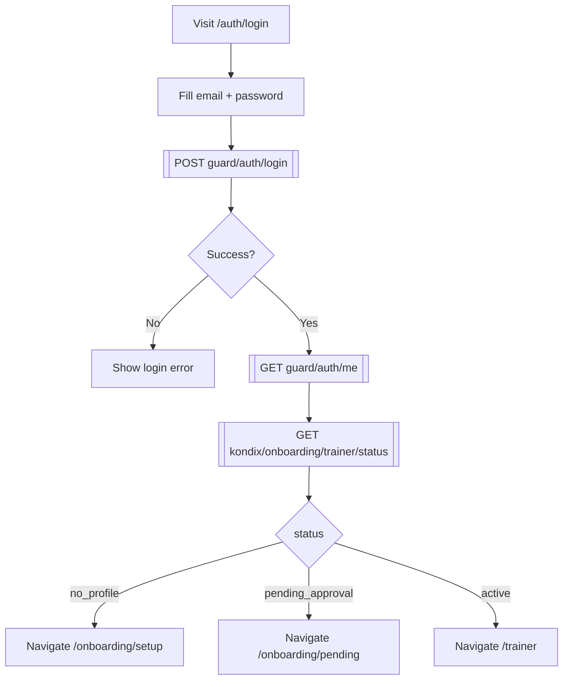
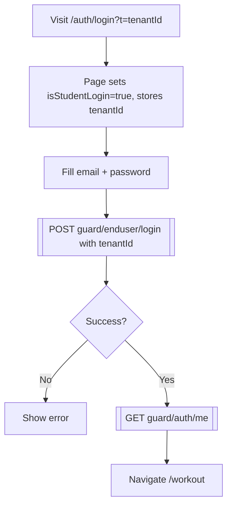
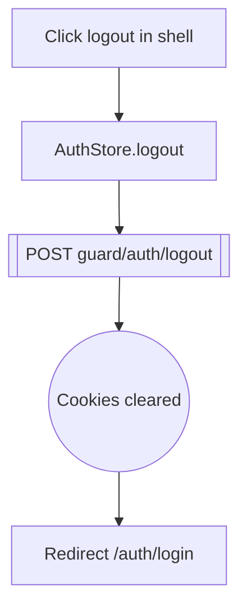
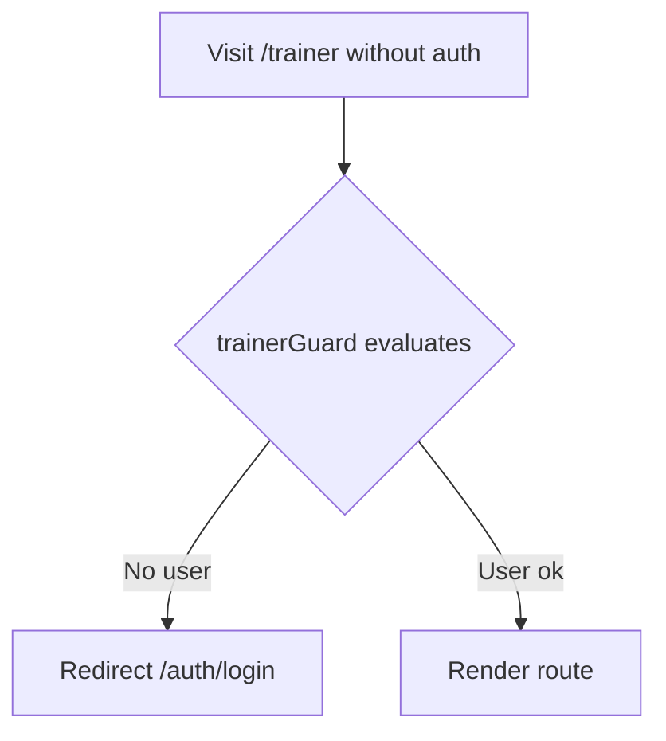

# 01 — Auth

**Roles:** public, trainer, student
**Preconditions:** CelvoGuard and Kondix API running.
**Test:** [`specs/01-auth.spec.ts`](../../kondix-web/e2e/specs/01-auth.spec.ts)

## Flow: trainer registration

```mermaid
flowchart TD
  AU1[Visit /auth/register] --> AU2[Fill displayName, email, password, confirm]
  AU2 --> AU3{Passwords match?}
  AU3 -- No --> AU4[Show "no coinciden" error]
  AU3 -- Yes --> AU5[[POST guard/auth/register]]
  AU5 --> AU6{Success?}
  AU6 -- No --> AU7[Show guard error]
  AU6 -- Yes --> AU8[[GET guard/auth/me]]
  AU8 --> AU9((User stored in AuthStore))
  AU9 --> AU10[Navigate /onboarding/setup]
```

## Flow: trainer login



## Flow: student login (tenant-scoped)



## Flow: logout



## Flow: protected route redirect



## Nodes

| ID   | Type    | Description                                           |
|------|---------|-------------------------------------------------------|
| AU1  | Action  | Navigate to `/auth/register`                          |
| AU2  | Action  | Fill registration form                                |
| AU3  | Decision| Password confirmation check                           |
| AU4  | State   | Client-side "no coinciden" error shown                |
| AU5  | API     | `POST {guardUrl}/api/v1/auth/register`                |
| AU6  | Decision| HTTP success                                          |
| AU7  | State   | Server error surfaced                                 |
| AU8  | API     | `GET {guardUrl}/api/v1/auth/me`                       |
| AU9  | State   | User written into AuthStore                           |
| AU10 | Action  | Navigate `/onboarding/setup`                          |
| AU20 | Action  | Navigate to `/auth/login`                             |
| AU21 | Action  | Fill login form                                       |
| AU22 | API     | `POST {guardUrl}/api/v1/auth/login`                   |
| AU23 | Decision| HTTP success                                          |
| AU24 | State   | Error shown                                           |
| AU25 | API     | `GET {guardUrl}/api/v1/auth/me`                       |
| AU26 | API     | `GET {apiUrl}/onboarding/trainer/status`              |
| AU27 | Decision| Status branch                                         |
| AU28 | Action  | Navigate `/onboarding/setup`                          |
| AU29 | Action  | Navigate `/onboarding/pending`                        |
| AU30 | Action  | Navigate `/trainer`                                   |
| AU40 | Action  | Navigate `/auth/login?t=...`                          |
| AU41 | State   | `isStudentLogin=true`, tenantId persisted             |
| AU42 | Action  | Fill login form                                       |
| AU43 | API     | `POST {guardUrl}/api/v1/enduser/login`                |
| AU44 | Decision| HTTP success                                          |
| AU45 | State   | Error shown                                           |
| AU46 | API     | `GET {guardUrl}/api/v1/auth/me`                       |
| AU47 | Action  | Navigate `/workout`                                   |
| AU60 | Action  | Click logout control                                  |
| AU61 | Action  | `AuthStore.logout()` invoked                          |
| AU62 | API     | `POST {guardUrl}/api/v1/auth/logout`                  |
| AU63 | State   | Cookies cleared                                       |
| AU64 | Action  | Redirect `/auth/login`                                |
| AU80 | Action  | Navigate to protected route `/trainer`                |
| AU81 | Decision| `trainerGuard` evaluation                             |
| AU82 | Action  | Redirect `/auth/login`                                |
| AU83 | State   | Route rendered                                        |
