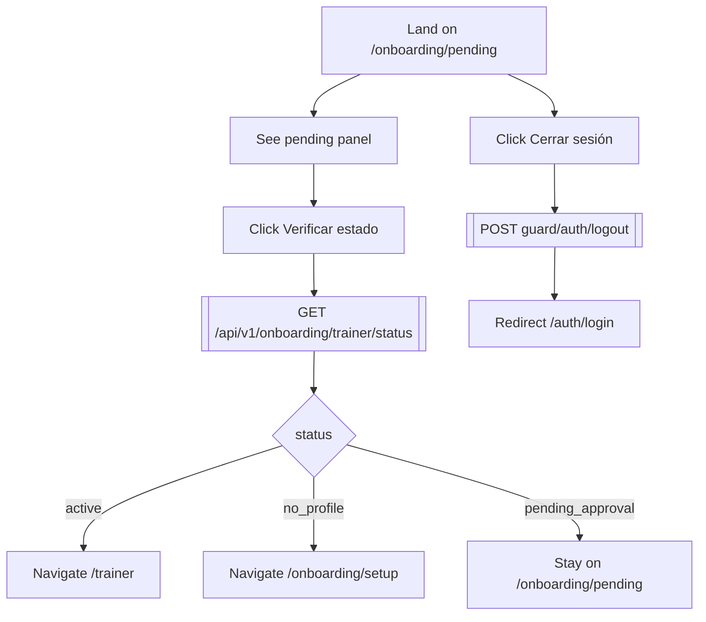

# 02 — Onboarding Trainer

**Role:** onboarding
**Preconditions:** User registered in CelvoGuard but no active Trainer row in Kondix yet.
**Test:** [`specs/02-onboarding-trainer.spec.ts`](../../kondix-web/e2e/specs/02-onboarding-trainer.spec.ts)

## Flow: setup → pending

```mermaid
flowchart TD
  ON1[Visit /onboarding/setup] --> ON2[Fill displayName + optional bio]
  ON2 --> ON3[Click Continuar]
  ON3 --> ON4[[POST /api/v1/onboarding/trainer/setup]]
  ON4 --> ON5{Success?}
  ON5 -- No: "already exists" --> ON6[[GET /api/v1/onboarding/trainer/status]]
  ON6 --> ON7{status}
  ON7 -- active --> ON8[Navigate /trainer]
  ON7 -- pending --> ON9[Navigate /onboarding/pending]
  ON5 -- No: other error --> ON10[Show error message]
  ON5 -- Yes --> ON9
```

## Flow: pending-approval loop



## Nodes

| ID   | Type     | Description                                        |
|------|----------|----------------------------------------------------|
| ON1  | Action   | Navigate to `/onboarding/setup`                    |
| ON2  | Action   | Fill displayName + bio                             |
| ON3  | Action   | Click "Continuar"                                  |
| ON4  | API      | `POST /api/v1/onboarding/trainer/setup`            |
| ON5  | Decision | HTTP success                                       |
| ON6  | API      | `GET /api/v1/onboarding/trainer/status`            |
| ON7  | Decision | status branch (active/pending)                     |
| ON8  | Action   | Navigate `/trainer`                                |
| ON9  | Action   | Navigate `/onboarding/pending`                     |
| ON10 | State    | Error message shown                                |
| ON20 | State    | Pending panel rendered                             |
| ON21 | State    | User sees "Perfil creado" panel                    |
| ON22 | Action   | Click "Verificar estado"                           |
| ON23 | API      | `GET /api/v1/onboarding/trainer/status`            |
| ON24 | Decision | status branch                                      |
| ON25 | Action   | Navigate `/trainer` (now active)                   |
| ON26 | Action   | Navigate `/onboarding/setup` (profile disappeared) |
| ON27 | State    | Remain on `/onboarding/pending`                    |
| ON28 | Action   | Click "Cerrar sesión"                              |
| ON29 | API      | `POST guard/auth/logout`                           |
| ON30 | Action   | Redirect `/auth/login`                             |
