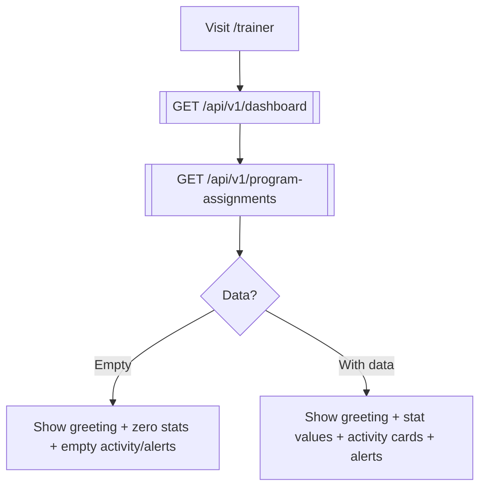
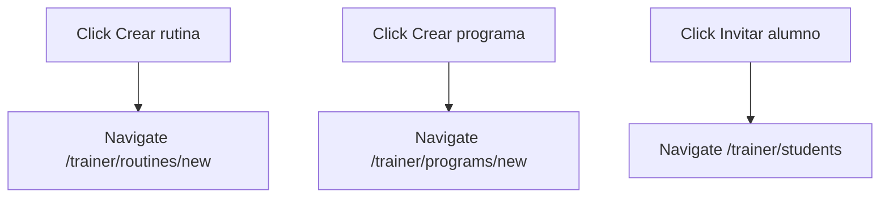

# 03 — Trainer Dashboard

**Role:** trainer (operator)
**Preconditions:** Trainer registered, onboarding complete, approved. Cookies set.
**Test:** [`specs/03-trainer-dashboard.spec.ts`](../../kondix-web/e2e/specs/03-trainer-dashboard.spec.ts)

## Flow: load dashboard

## Flow: quick-action navigation

## Nodes

| ID   | Type     | Description                                       |
|------|----------|---------------------------------------------------|
| DA1  | Action   | Navigate to `/trainer`                            |
| DA2  | API      | `GET /api/v1/dashboard`                           |
| DA3  | API      | `GET /api/v1/program-assignments`                 |
| DA4  | Decision | Has data to render                                |
| DA5  | State    | Empty dashboard with zero metrics                 |
| DA6  | State    | Populated dashboard (not covered in Phase 3a)     |
| DA10 | Action   | Click "Crear rutina" quick action                 |
| DA11 | Action   | Navigate to `/trainer/routines/new`               |
| DA12 | Action   | Click "Crear programa" quick action               |
| DA13 | Action   | Navigate to `/trainer/programs/new`               |
| DA14 | Action   | Click "Invitar alumno" quick action               |
| DA15 | Action   | Navigate to `/trainer/students`                   |

## Notes

- "Populated" state (DA6) requires seeded students + sessions; deferred to Phase 3c or a later integration spec.
- Notification bell is inert (no route); ignored here.
