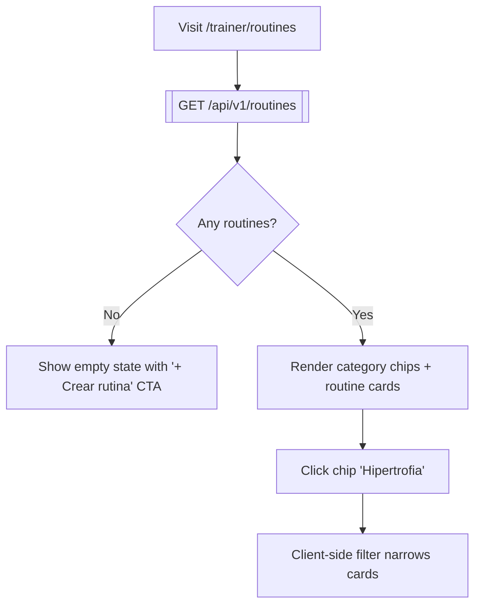
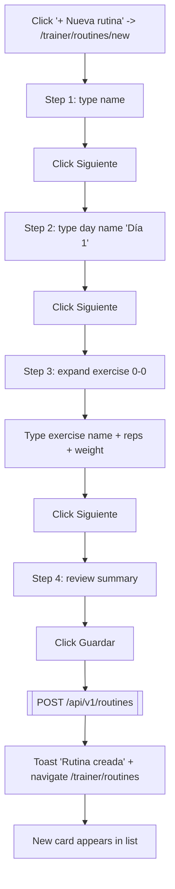
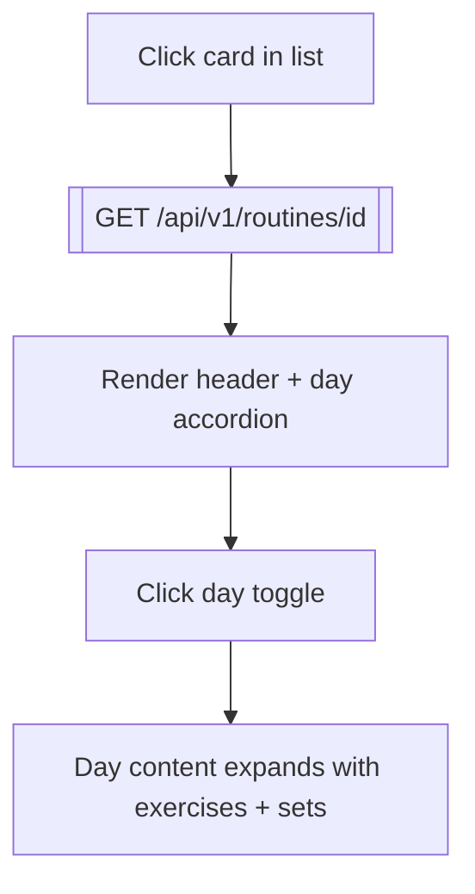
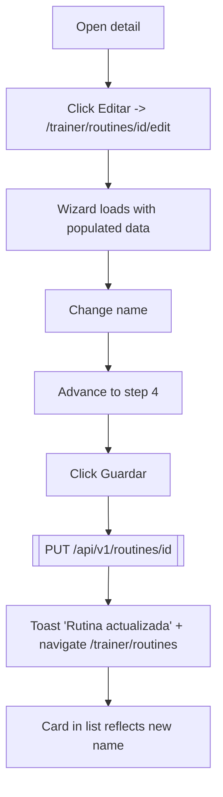
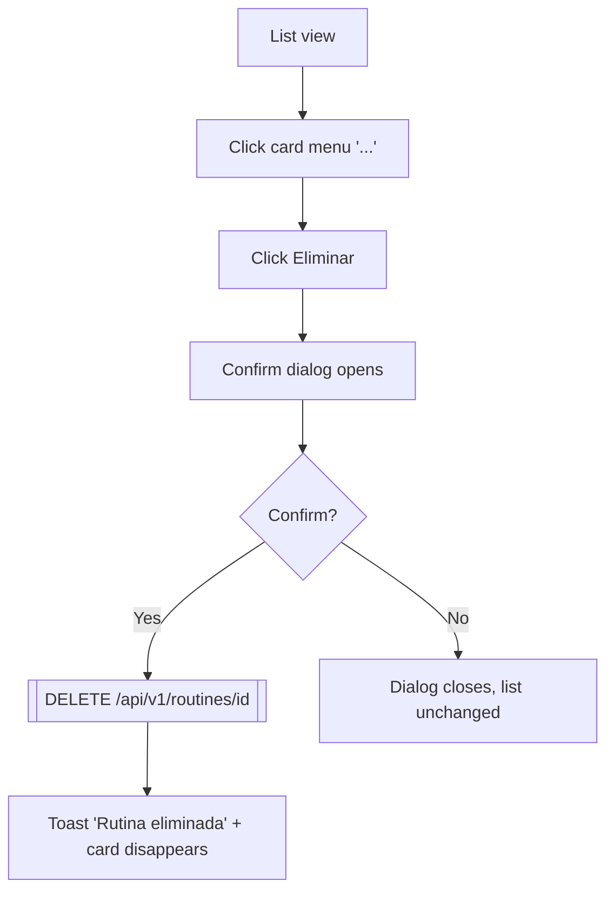

# 04 — Trainer Routines

**Role:** trainer (operator)
**Preconditions:** Trainer registered, onboarding complete, approved. Cookies set.
**Test:** [`specs/04-trainer-routines.spec.ts`](../../kondix-web/e2e/specs/04-trainer-routines.spec.ts)

## Flow: list + filter

## Flow: create via 4-step wizard

## Flow: view detail

## Flow: edit (full replace)

## Flow: delete

## Nodes

| ID       | Type     | Description                                        |
|----------|----------|----------------------------------------------------|
| RT1      | Action   | Navigate to `/trainer/routines`                    |
| RT2      | API      | `GET /api/v1/routines`                             |
| RT3      | Decision | List empty?                                        |
| RT4      | State    | Empty-state with '+ Crear rutina' link             |
| RT5      | State    | List rendered with category chips                  |
| RT6-RT7  | Action   | Chip click → client-side filter                    |
| RT10-RT22| Action   | 4-step wizard create happy path                    |
| RT30-RT34| Action   | Detail view with expandable day accordion          |
| RT40-RT48| Action   | Edit flow: wizard pre-populated, full-replace save |
| RT50-RT57| Action   | Delete with confirm dialog                         |

## Notes

- Wizard validates name non-empty to advance from step 1 (Siguiente is disabled). Not explicitly asserted in Phase 3b — happy path always fills it.
- Step 2 requires every day to have a non-empty name; the spec sets it.
- Exercise catalog autocomplete (dropdown on exercise name input) fires on `input`/`focus` but is ignored by the spec — we type a free-form name.
- Superset/Triset/Circuit group types and DropSet/RestPause/AMRAP set types not exercised; happy path uses `Single` group + `Effective` set.
- Video upload (MinIO) not exercised in Phase 3b — deferred.
- Usage banner ("rutina con sesiones") not exercised — requires seeded sessions; Phase 3c or later.
