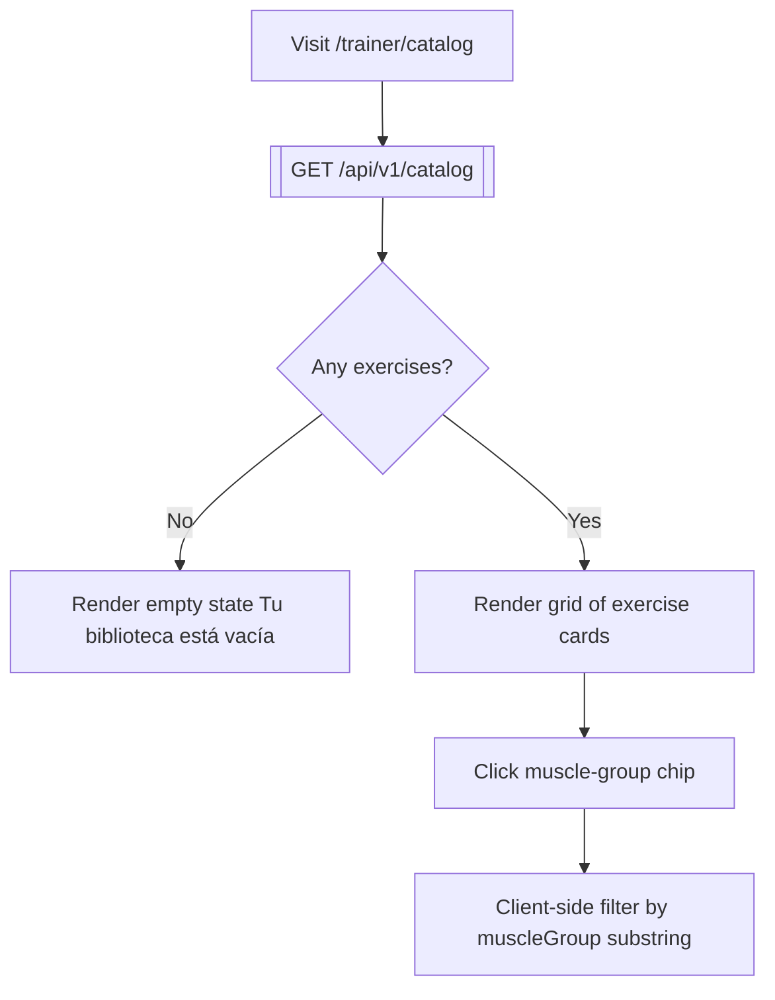
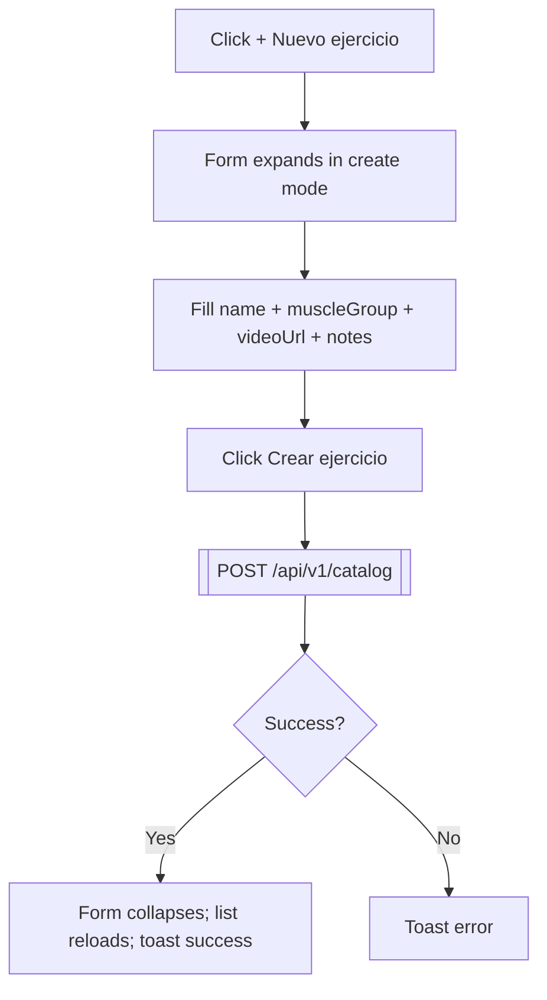
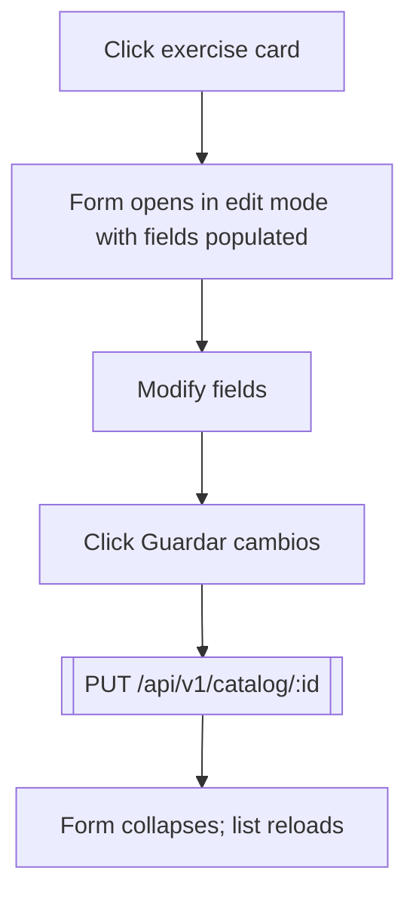
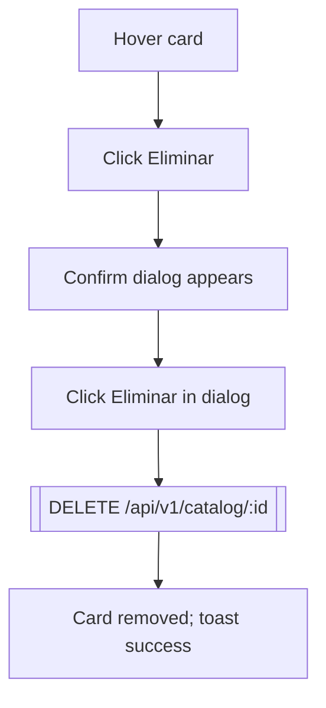

# 07 — Trainer Catalog

**Role:** trainer
**Preconditions:** Trainer active on /trainer/catalog.
**Test:** [`specs/07-trainer-catalog.spec.ts`](../../kondix-web/e2e/specs/07-trainer-catalog.spec.ts)

## Flow: list + filter

## Flow: create exercise

## Flow: edit exercise

## Flow: delete exercise

## Nodes

| ID   | Type     | Description                                   |
|------|----------|-----------------------------------------------|
| CA1  | Action   | Navigate to `/trainer/catalog`                |
| CA2  | API      | `GET /api/v1/catalog`                         |
| CA3  | Decision | Trainer has any exercises                     |
| CA4  | State    | Empty state rendered                          |
| CA5  | State    | Exercise grid rendered                        |
| CA6  | Action   | Click a muscle-group chip                     |
| CA7  | State    | Grid filtered client-side                     |
| CA10 | Action   | Click "+ Nuevo ejercicio"                     |
| CA11 | State    | Form expanded (create mode)                   |
| CA12 | Action   | Fill form fields                              |
| CA13 | Action   | Click "Crear ejercicio"                       |
| CA14 | API      | `POST /api/v1/catalog`                        |
| CA15 | Decision | HTTP success                                  |
| CA16 | State    | Form collapses; grid refetched                |
| CA17 | State    | Toast error                                   |
| CA20 | Action   | Click existing exercise card                  |
| CA21 | State    | Form opened in edit mode, fields prefilled    |
| CA22 | Action   | Modify any field                              |
| CA23 | Action   | Click "Guardar cambios"                       |
| CA24 | API      | `PUT /api/v1/catalog/:id`                     |
| CA25 | State    | Form collapses; grid refetched                |
| CA30 | Action   | Hover over a card                             |
| CA31 | Action   | Click the Eliminar hover button               |
| CA32 | State    | Confirm dialog open                           |
| CA33 | Action   | Click "Eliminar" inside dialog                |
| CA34 | API      | `DELETE /api/v1/catalog/:id`                  |
| CA35 | State    | Card removed                                  |
