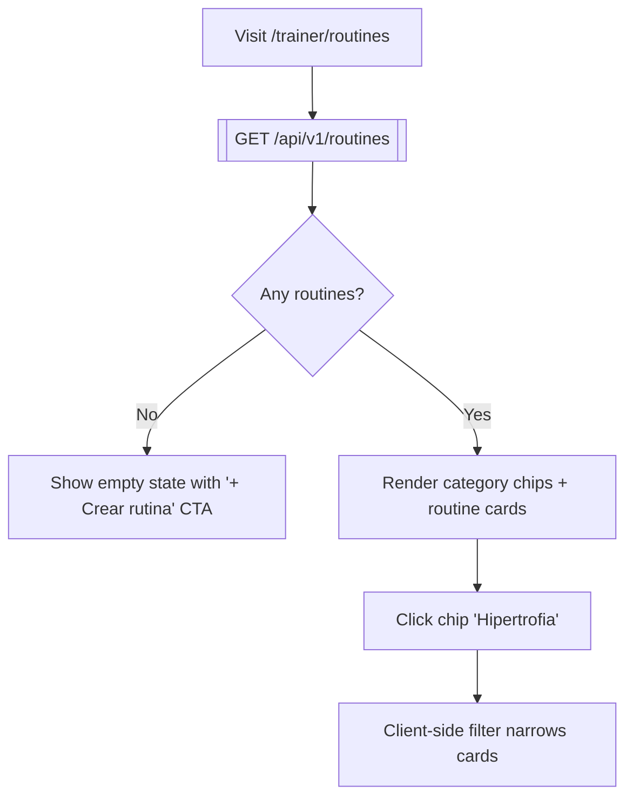
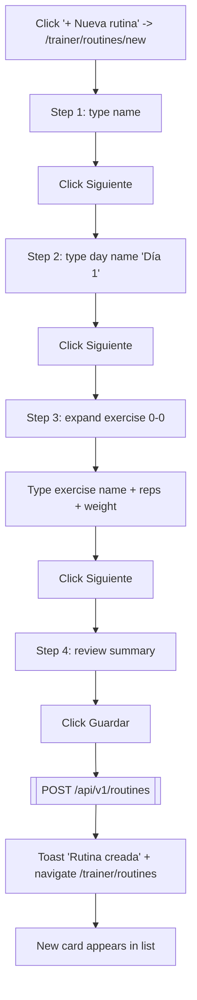
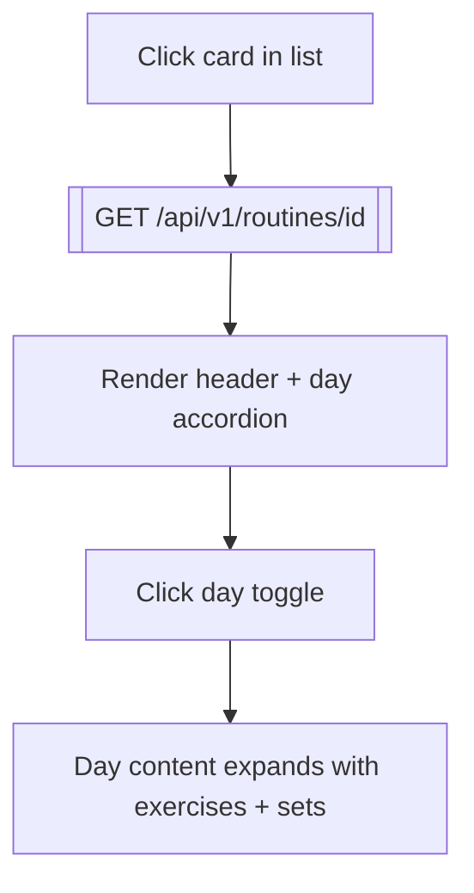
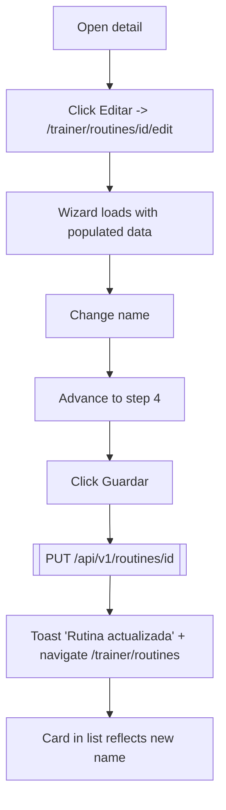
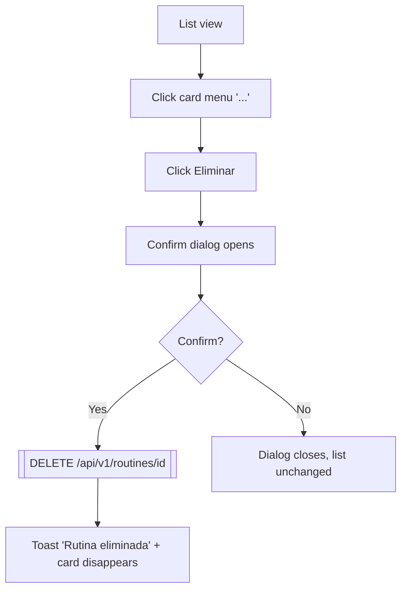

# Flow Testing — Phase 3b (Routines: list + wizard + detail) Implementation Plan

> **For agentic workers:** REQUIRED SUB-SKILL: Use superpowers:subagent-driven-development (recommended) or superpowers:executing-plans to implement this plan task-by-task. Steps use checkbox (`- [ ]`) syntax for tracking.

**Goal:** Cover flow `04-trainer-routines` — list + filter, create via 4-step wizard, view detail, edit (full replace), delete with confirmation — with a Mermaid diagram and Playwright specs built on the Phase 3a harness.

**Architecture:** Builds on `feat/flow-testing-phase-2` (all phases 1+2+3a work). Zero `data-testid`s exist on the routines feature today; each testable element gets one added. A new `createRoutineViaApi(page, input)` fixture helper lets delete/edit/view-detail specs bypass the wizard UI and arrange state fast. The existing `cleanup` internal endpoint already cascades Routine deletion through the Trainer FK in Postgres — no backend change needed for Phase 3b.

**Tech Stack:** Same as Phase 1/2/3a — Angular 21, `@playwright/test` 1.59, Mermaid, .NET 10 Kondix API.

**Scope decision:** Phase 3 is split into three sub-plans. Phase 3a (dashboard + catalog) is Done. This plan is Phase 3b. Phase 3c (programs + students, assignment lifecycle) follows.

**Out of scope for this plan:**
- Video upload on step 3 (exercise.videoInputMode = 'upload') — complex `<input type=file>` path with MinIO; cover in a targeted later pass.
- Catalog autocomplete dropdown on exercise name — typed into input, ignore suggestions popup.
- Day reorder (up/down arrows) — tested only as clickable, not by drag.
- Superset/Triset/Circuit group types beyond `Single` — happy path uses `Single`.
- Duplicate routine — happy path only asserts the duplicate button is present; functional test deferred.
- Usage banner on edit (routine with active sessions/assignments) — requires seeded assignments; covered in Phase 3c.

---

## File Structure

**Created:**
- `docs/flows/04-trainer-routines.md`
- `kondix-web/e2e/pages/trainer/routine-list.page.ts`
- `kondix-web/e2e/pages/trainer/routine-wizard.page.ts`
- `kondix-web/e2e/pages/trainer/routine-detail.page.ts`
- `kondix-web/e2e/specs/04-trainer-routines.spec.ts`

**Modified:**
- `kondix-web/src/app/features/trainer/routines/feature/routine-list.ts` — add `data-testid`s
- `kondix-web/src/app/features/trainer/routines/feature/routine-wizard.ts` — add `data-testid`s (all 4 steps)
- `kondix-web/src/app/features/trainer/routines/feature/routine-detail.ts` — add `data-testid`s
- `kondix-web/e2e/fixtures/auth.ts` — add `createRoutineViaApi(page, input)` helper
- `docs/flows/00-inventory.md` — flip `04-trainer-routines.md` rows Pending → Done

---

## Testid naming convention (for reference across tasks)

Stable selectors follow these patterns so page objects stay deterministic:

- **List page**: `routine-list-title`, `routine-list-new`, `routine-list-empty`, `routine-list-empty-new`, `routine-chip-all`, `routine-chip-{category}`, `routine-card-{id}`, `routine-card-{id}-menu`, `routine-card-{id}-edit`, `routine-card-{id}-duplicate`, `routine-card-{id}-delete`, `routine-delete-dialog`.
- **Wizard page**: `wizard-name`, `wizard-category-{cat}`, `wizard-description`, `wizard-tag-input`, `wizard-day-add`, `wizard-day-{i}-name`, `wizard-day-{i}-remove`, `wizard-day-tab-{i}`, `wizard-group-add`, `wizard-group-{gi}-type`, `wizard-group-{gi}-rest`, `wizard-group-{gi}-remove`, `wizard-exercise-add-{gi}`, `wizard-exercise-{gi}-{ei}-name`, `wizard-exercise-{gi}-{ei}-notes`, `wizard-exercise-{gi}-{ei}-remove`, `wizard-exercise-{gi}-{ei}-toggle`, `wizard-set-add-{gi}-{ei}`, `wizard-set-{gi}-{ei}-{si}-type`, `wizard-set-{gi}-{ei}-{si}-reps`, `wizard-set-{gi}-{ei}-{si}-weight`, `wizard-set-{gi}-{ei}-{si}-rpe`, `wizard-set-{gi}-{ei}-{si}-rest`, `wizard-set-{gi}-{ei}-{si}-remove`, `wizard-btn-cancel`, `wizard-btn-next`, `wizard-btn-back`, `wizard-btn-save`. (Next/Back/Save are unique per step so a single testid per role works.)
- **Detail page**: `routine-detail-name`, `routine-detail-edit`, `routine-detail-duplicate`, `routine-detail-delete`, `routine-detail-delete-dialog`, `routine-day-toggle-{index}`, `routine-day-content-{index}`.

---

## Task 1: Add `data-testid`s to `routine-list.ts`

**Goal:** Stable selectors on every element the list spec touches. Leave existing classes, bindings, and layout untouched.

**Files:**
- Modify: `kondix-web/src/app/features/trainer/routines/feature/routine-list.ts`

- [ ] **Step 1: Add testid to the page header + "+ Nueva rutina" link**

Locate around line 20-24:

```html
<h1 class="font-display text-2xl font-extrabold">Rutinas</h1>
<a
  routerLink="new"
  class="bg-primary hover:bg-primary-hover text-white text-sm font-medium px-4 py-2 rounded-lg transition press"
>+ Nueva rutina</a>
```

Change to:

```html
<h1 data-testid="routine-list-title" class="font-display text-2xl font-extrabold">Rutinas</h1>
<a
  routerLink="new"
  data-testid="routine-list-new"
  class="bg-primary hover:bg-primary-hover text-white text-sm font-medium px-4 py-2 rounded-lg transition press"
>+ Nueva rutina</a>
```

- [ ] **Step 2: Add testid to the empty state + its CTA**

Locate around line 34-42:

```html
<kx-empty-state
  title="Sin rutinas"
  subtitle="Creá tu primera rutina para empezar">
  <a routerLink="new"
    class="inline-block mt-4 bg-primary hover:bg-primary-hover text-white text-sm font-medium px-5 py-2 rounded-lg transition press">
    + Crear rutina
  </a>
</kx-empty-state>
```

Change to:

```html
<kx-empty-state
  data-testid="routine-list-empty"
  title="Sin rutinas"
  subtitle="Creá tu primera rutina para empezar">
  <a routerLink="new"
    data-testid="routine-list-empty-new"
    class="inline-block mt-4 bg-primary hover:bg-primary-hover text-white text-sm font-medium px-5 py-2 rounded-lg transition press">
    + Crear rutina
  </a>
</kx-empty-state>
```

- [ ] **Step 3: Add testids to category filter chips**

Locate the chips around line 45-63. Update the "Todas" button and the `@for` loop:

```html
<button (click)="filterCategory.set(null)"
  data-testid="routine-chip-all"
  class="text-xs px-3 py-1 rounded-full border transition"
  [class]="!filterCategory()
    ? 'bg-primary/10 text-primary border-primary/30'
    : 'bg-card text-text-secondary border-border hover:border-border-light'">
  Todas
</button>
@for (cat of categories(); track cat) {
  <button (click)="filterCategory.set(cat)"
    [attr.data-testid]="'routine-chip-' + cat"
    class="text-xs px-3 py-1 rounded-full border transition"
    [class]="filterCategory() === cat
      ? 'bg-primary/10 text-primary border-primary/30'
      : 'bg-card text-text-secondary border-border hover:border-border-light'">
    {{ cat }}
  </button>
}
```

- [ ] **Step 4: Add testids to the routine card + its context menu**

Locate around line 73-113. Update the outer card `div` and the three menu items:

```html
<div
  (click)="navigateTo(routine.id)"
  [attr.data-testid]="'routine-card-' + routine.id"
  class="bg-card border border-border rounded-2xl p-4 cursor-pointer hover:bg-card-hover transition-colors"
>
  <!-- Top row -->
  <div class="flex items-start justify-between gap-2">
    <div class="flex items-center gap-2 flex-wrap min-w-0">
      <span class="font-semibold text-text truncate">{{ routine.name }}</span>
      @if (routine.category) {
        <kx-badge [text]="routine.category" variant="info" />
      }
    </div>
    <!-- Context menu -->
    <div class="relative z-20 shrink-0">
      <button
        (click)="$event.stopPropagation(); toggleMenu(routine.id)"
        [attr.data-testid]="'routine-card-' + routine.id + '-menu'"
        class="text-text-muted hover:text-text w-7 h-7 flex items-center justify-center rounded-lg hover:bg-bg-raised transition text-lg leading-none"
        aria-label="Más opciones"
      >⋯</button>
      @if (openMenuId() === routine.id) {
        <div class="absolute right-0 top-8 bg-card border border-border rounded-xl shadow-xl py-1 w-36 z-30"
          (click)="$event.stopPropagation()">
          <button
            (click)="openMenuId.set(null); navigateTo(routine.id + '/edit')"
            [attr.data-testid]="'routine-card-' + routine.id + '-edit'"
            class="w-full text-left text-sm px-3 py-2 hover:bg-bg-raised text-text transition">
            Editar
          </button>
          <button
            (click)="openMenuId.set(null); duplicateRoutine(routine.id)"
            [attr.data-testid]="'routine-card-' + routine.id + '-duplicate'"
            class="w-full text-left text-sm px-3 py-2 hover:bg-bg-raised text-text transition">
            Duplicar
          </button>
          <button
            (click)="openMenuId.set(null); requestDelete(routine.id)"
            [attr.data-testid]="'routine-card-' + routine.id + '-delete'"
            class="w-full text-left text-sm px-3 py-2 hover:bg-bg-raised text-danger transition">
            Eliminar
          </button>
        </div>
      }
    </div>
  </div>
  <!-- Bottom row unchanged -->
  <p class="text-xs text-text-secondary mt-2">
    {{ routine.dayCount }} días · {{ routine.exerciseCount }} ejercicios · Editada {{ relativeDate(routine.updatedAt) }}
  </p>
</div>
```

- [ ] **Step 5: Add testid to the delete confirm dialog**

Locate at the bottom of the template (line 125-132):

```html
<kx-confirm-dialog
  data-testid="routine-delete-dialog"
  [open]="showDeleteDialog()"
  title="Eliminar rutina"
  message="Esta acción no se puede deshacer. ¿Estás seguro?"
  confirmLabel="Eliminar"
  variant="danger"
  (confirmed)="confirmDelete()"
  (cancelled)="showDeleteDialog.set(false)" />
```

- [ ] **Step 6: Verify the app still builds**

```bash
cd kondix-web && npm run build 2>&1 | tail -10 && cd ..
```

Expected: `Application bundle generation complete.`

- [ ] **Step 7: Commit**

```bash
git add kondix-web/src/app/features/trainer/routines/feature/routine-list.ts
git commit -m "$(cat <<'EOF'
chore(ui): add data-testids to trainer routine list

Prep for Phase 3b E2E coverage. Testids follow the routine-list-*,
routine-chip-*, routine-card-{id}-* conventions documented in the
Phase 3b plan.

Co-Authored-By: Claude Opus 4.7 (1M context) <noreply@anthropic.com>
EOF
)"
```

---

## Task 2: Add `data-testid`s to `routine-wizard.ts` step 1 (Info básica)

**Goal:** Testids for name, category chips, description, tags, and the step-1 navigation buttons. Step 2, 3, 4 are separate tasks to keep diffs reviewable.

**Files:**
- Modify: `kondix-web/src/app/features/trainer/routines/feature/routine-wizard.ts`

- [ ] **Step 1: Testid on the name input**

Locate around line 98-102:

```html
<input id="routine-name" type="text" [(ngModel)]="name" name="name"
  class="w-full bg-card border border-border rounded-xl px-4 py-3 text-text focus:outline-none focus:border-primary transition"
  placeholder="Ej: Push / Pull / Legs" />
```

Change to:

```html
<input id="routine-name" type="text" [(ngModel)]="name" name="name"
  data-testid="wizard-name"
  class="w-full bg-card border border-border rounded-xl px-4 py-3 text-text focus:outline-none focus:border-primary transition"
  placeholder="Ej: Push / Pull / Legs" />
```

- [ ] **Step 2: Testids on category chip buttons**

Locate around line 107-119:

```html
@for (cat of categories; track cat) {
  <button type="button" (click)="toggleCategory(cat)"
    [attr.data-testid]="'wizard-category-' + cat"
    class="bg-card border rounded-xl px-4 py-2 text-sm cursor-pointer transition"
    [class.border-border]="category !== cat"
    [class.text-text-secondary]="category !== cat"
    [class.bg-primary/10]="category === cat"
    [class.text-primary]="category === cat"
    [class.border-primary/30]="category === cat">
    {{ cat }}
  </button>
}
```

- [ ] **Step 3: Testid on description textarea**

Locate around line 125-127:

```html
<textarea id="routine-desc" [(ngModel)]="description" name="description" rows="3"
  data-testid="wizard-description"
  class="w-full bg-card border border-border rounded-xl px-4 py-3 text-text focus:outline-none focus:border-primary transition resize-none"
  placeholder="Describe el objetivo de esta rutina..."></textarea>
```

- [ ] **Step 4: Testid on tag input**

Locate around line 140-143:

```html
<input type="text" [(ngModel)]="tagInput" name="tagInput" maxlength="50"
  (keydown.enter)="addTag($event)"
  data-testid="wizard-tag-input"
  class="bg-transparent text-text text-sm flex-1 min-w-[60px] focus:outline-none"
  placeholder="Agregar tag..." />
```

- [ ] **Step 5: Testids on step-1 navigation buttons**

Locate around line 148-157:

```html
<div class="flex gap-3 pt-2">
  <button type="button" (click)="cancel()"
    data-testid="wizard-btn-cancel"
    class="flex-1 bg-card border border-border text-text-secondary py-3 rounded-xl transition hover:bg-card-hover">
    Cancelar
  </button>
  <button type="button" (click)="goToStep(2)" [disabled]="!name.trim()"
    data-testid="wizard-btn-next"
    class="flex-1 bg-primary hover:bg-primary-hover text-white font-semibold py-3 rounded-xl transition press">
    Siguiente: Dias
  </button>
</div>
```

- [ ] **Step 6: Verify build**

```bash
cd kondix-web && npm run build 2>&1 | tail -10 && cd ..
```

Expected: `Application bundle generation complete.`

- [ ] **Step 7: Commit**

```bash
git add kondix-web/src/app/features/trainer/routines/feature/routine-wizard.ts
git commit -m "chore(ui): add data-testids to routine wizard step 1 (info)"
```

---

## Task 3: Add `data-testid`s to wizard step 2 (Días)

**Files:**
- Modify: `kondix-web/src/app/features/trainer/routines/feature/routine-wizard.ts`

- [ ] **Step 1: Testids on day inputs + remove buttons**

Locate the step-2 day loop around line 170-198. Update the `<input>` and the remove button:

```html
@for (day of days(); track $index; let di = $index) {
  <div class="flex items-center gap-3 bg-card border border-border rounded-xl px-4 py-3">
    <span class="w-8 h-8 rounded-lg bg-primary/10 text-primary text-sm font-bold flex items-center justify-center shrink-0">
      {{ di + 1 }}
    </span>

    <input type="text" [ngModel]="day.name" (ngModelChange)="updateDayName(di, $event)" [name]="'day-' + di"
      [attr.data-testid]="'wizard-day-' + di + '-name'"
      class="flex-1 bg-transparent text-text font-medium focus:outline-none border-b border-transparent focus:border-primary pb-0.5"
      placeholder="Nombre del dia (ej: Pecho y Triceps)" />

    @if (days().length > 1) {
      <div class="flex flex-col gap-0.5">
        @if (di > 0) {
          <button type="button" (click)="moveDay(di, -1)" class="text-text-muted hover:text-primary text-xs transition" aria-label="Mover arriba">&#9650;</button>
        }
        @if (di < days().length - 1) {
          <button type="button" (click)="moveDay(di, 1)" class="text-text-muted hover:text-primary text-xs transition" aria-label="Mover abajo">&#9660;</button>
        }
      </div>
    }

    <button type="button" (click)="removeDay(di)"
      [attr.data-testid]="'wizard-day-' + di + '-remove'"
      class="text-text-muted hover:text-danger text-lg px-1 transition" aria-label="Eliminar dia">&#10005;</button>
  </div>
}
```

- [ ] **Step 2: Testid on "+ Agregar dia" button**

Locate around line 202-205:

```html
<button type="button" (click)="addDay()"
  data-testid="wizard-day-add"
  class="w-full border border-dashed border-border text-text-secondary hover:text-primary hover:border-primary rounded-xl py-3 text-sm transition">
  + Agregar dia
</button>
```

- [ ] **Step 3: Testids on step-2 navigation buttons**

Locate around line 208-217:

```html
<div class="flex gap-3 pt-2">
  <button type="button" (click)="goToStep(1)"
    data-testid="wizard-btn-back"
    class="flex-1 bg-card border border-border text-text-secondary py-3 rounded-xl transition hover:bg-card-hover">
    &larr; Anterior
  </button>
  <button type="button" (click)="goToStep(3)" [disabled]="!canAdvanceFromDays()"
    data-testid="wizard-btn-next"
    class="flex-1 bg-primary hover:bg-primary-hover text-white font-semibold py-3 rounded-xl transition press">
    Siguiente: Ejercicios
  </button>
</div>
```

Note: `wizard-btn-back` and `wizard-btn-next` are unique per step (only one of each is rendered at a time because each `@case` is mutually exclusive), so reusing the same testid across steps is intentional.

- [ ] **Step 4: Verify build**

```bash
cd kondix-web && npm run build 2>&1 | tail -10 && cd ..
```

- [ ] **Step 5: Commit**

```bash
git add kondix-web/src/app/features/trainer/routines/feature/routine-wizard.ts
git commit -m "chore(ui): add data-testids to routine wizard step 2 (days)"
```

---

## Task 4: Add `data-testid`s to wizard step 3 (Ejercicios)

**Goal:** Step 3 has day tabs on the left and group/exercise/set editors on the right. This is the densest step — many nested testids.

**Files:**
- Modify: `kondix-web/src/app/features/trainer/routines/feature/routine-wizard.ts`

- [ ] **Step 1: Testids on day tabs (left panel)**

Locate around line 230-247. Update the button:

```html
@for (day of days(); track $index; let di = $index) {
  <button type="button" (click)="selectedDayIndex.set(di)"
    [attr.data-testid]="'wizard-day-tab-' + di"
    class="w-full text-left px-3 py-2.5 rounded-lg text-sm transition border-l-2"
    [class.border-primary]="selectedDayIndex() === di"
    [class.bg-primary/5]="selectedDayIndex() === di"
    [class.text-text]="selectedDayIndex() === di"
    [class.font-semibold]="selectedDayIndex() === di"
    [class.border-transparent]="selectedDayIndex() !== di"
    [class.text-text-muted]="selectedDayIndex() !== di"
    [class.hover:text-text]="selectedDayIndex() !== di"
    [class.hover:bg-card]="selectedDayIndex() !== di">
    <div>{{ day.name || 'Dia ' + (di + 1) }}</div>
    <div class="text-xs mt-0.5 text-text-muted">
      {{ countExercises(di) }} ejercicio{{ countExercises(di) !== 1 ? 's' : '' }}
    </div>
  </button>
}
```

- [ ] **Step 2: Testids on group header controls**

Locate around line 257-274. Update the group type select, rest input, and remove button:

```html
<select [ngModel]="group.groupType" (ngModelChange)="updateGroupType(gi, $event)" [name]="'gt-' + gi"
  [attr.data-testid]="'wizard-group-' + gi + '-type'"
  class="bg-card border border-border rounded-lg px-2.5 py-1.5 text-xs text-text"
  [attr.aria-label]="'Tipo de grupo'">
  <option value="Single">Individual</option>
  <option value="Superset">Superset</option>
  <option value="Triset">Triset</option>
  <option value="Circuit">Circuito</option>
</select>
<div class="flex items-center gap-1.5">
  <input type="number" [ngModel]="group.restSeconds" (ngModelChange)="updateGroupRest(gi, $event)" [name]="'grest-' + gi"
    [attr.data-testid]="'wizard-group-' + gi + '-rest'"
    class="bg-card border border-border rounded-lg px-2 py-1.5 text-xs text-text w-16 text-center" placeholder="90"
    [attr.aria-label]="'Descanso del grupo'" />
  <span class="text-text-muted text-xs">seg</span>
</div>
<button type="button" (click)="removeGroup(gi)"
  [attr.data-testid]="'wizard-group-' + gi + '-remove'"
  class="text-text-muted hover:text-danger text-xs px-2 py-1 rounded transition ml-auto" aria-label="Eliminar grupo">&#10005;</button>
```

- [ ] **Step 3: Testid on exercise name input + notes + remove + toggle (collapsed/expanded)**

Locate the exercise name input around line 288-295 (expanded view):

```html
<input type="text" [ngModel]="ex.name" (ngModelChange)="updateExerciseName(gi, ei, $event)"
  (input)="searchCatalog(gi, ei)"
  (focus)="searchCatalog(gi, ei)"
  (blur)="hideSuggestionsDelayed()"
  [name]="'ex-' + gi + '-' + ei"
  [attr.data-testid]="'wizard-exercise-' + gi + '-' + ei + '-name'"
  autocomplete="off"
  class="w-full bg-transparent text-sm font-medium text-text focus:outline-none border-b border-border-light focus:border-primary pb-0.5"
  placeholder="Nombre del ejercicio" />
```

Notes input around line 358-361:

```html
<input type="text" [ngModel]="ex.notes" (ngModelChange)="updateExerciseNotes(gi, ei, $event)"
  [name]="'notes-' + gi + '-' + ei"
  [attr.data-testid]="'wizard-exercise-' + gi + '-' + ei + '-notes'"
  class="w-full bg-card border border-border-light rounded-lg px-3 py-1.5 text-xs text-text focus:outline-none focus:border-primary"
  placeholder="Notas del ejercicio (opcional)" />
```

Remove button around line 314-315:

```html
<button type="button" (click)="$event.stopPropagation(); removeExercise(gi, ei)"
  [attr.data-testid]="'wizard-exercise-' + gi + '-' + ei + '-remove'"
  class="text-text-muted hover:text-danger text-xs px-1.5 py-1 rounded transition" aria-label="Eliminar ejercicio">&#10005;</button>
```

Collapsed view — the outer clickable `div` around line 418-426:

```html
<div class="flex items-center gap-2 px-3 py-2.5 bg-bg-raised rounded-lg cursor-pointer hover:bg-card-hover transition"
  [attr.data-testid]="'wizard-exercise-' + gi + '-' + ei + '-toggle'"
  (click)="toggleExercise(gi, ei)">
  <span class="w-6 h-6 rounded bg-primary/10 text-primary text-xs font-bold flex items-center justify-center shrink-0">
    {{ ei + 1 }}
  </span>
  <span class="flex-1 text-sm text-text font-medium truncate">{{ ex.name || 'Sin nombre' }}</span>
  <span class="text-xs text-text-muted">{{ ex.sets.length }} serie{{ ex.sets.length !== 1 ? 's' : '' }}</span>
  <span class="text-text-muted text-xs">&#9660;</span>
</div>
```

- [ ] **Step 4: Testids on set row inputs**

Locate the set row around line 380-408:

```html
<select [ngModel]="set.setType" (ngModelChange)="updateSetType(gi, ei, si, $event)"
  [name]="'st-' + gi + '-' + ei + '-' + si"
  [attr.data-testid]="'wizard-set-' + gi + '-' + ei + '-' + si + '-type'"
  class="w-24 bg-bg-raised border border-border-light rounded-lg px-1.5 py-1.5 text-xs text-text select-styled"
  [attr.aria-label]="'Tipo de serie'">
  <option value="Warmup">Calentam.</option>
  <option value="Effective">Efectiva</option>
  <option value="DropSet">Drop set</option>
  <option value="RestPause">Rest-pause</option>
  <option value="AMRAP">AMRAP</option>
</select>
<input type="text" [ngModel]="set.targetReps" (ngModelChange)="updateSetField(gi, ei, si, 'targetReps', $event)"
  [name]="'reps-' + gi + '-' + ei + '-' + si"
  [attr.data-testid]="'wizard-set-' + gi + '-' + ei + '-' + si + '-reps'"
  class="w-14 bg-bg-raised border border-border-light rounded-lg px-2 py-1.5 text-xs text-text text-center" placeholder="Reps"
  [attr.aria-label]="'Repeticiones'" />
<input type="text" [ngModel]="set.targetWeight" (ngModelChange)="updateSetField(gi, ei, si, 'targetWeight', $event)"
  [name]="'wt-' + gi + '-' + ei + '-' + si"
  [attr.data-testid]="'wizard-set-' + gi + '-' + ei + '-' + si + '-weight'"
  class="w-14 bg-bg-raised border border-border-light rounded-lg px-2 py-1.5 text-xs text-text text-center" placeholder="kg"
  [attr.aria-label]="'Peso'" />
<input type="number" [ngModel]="set.targetRpe" (ngModelChange)="updateSetRpe(gi, ei, si, $event)"
  [name]="'rpe-' + gi + '-' + ei + '-' + si"
  [attr.data-testid]="'wizard-set-' + gi + '-' + ei + '-' + si + '-rpe'"
  class="w-14 bg-bg-raised border border-border-light rounded-lg px-2 py-1.5 text-xs text-text text-center" placeholder="RPE"
  min="1" max="10" [attr.aria-label]="'RPE'" />
<input type="number" [ngModel]="set.restSeconds" (ngModelChange)="updateSetRest(gi, ei, si, $event)"
  [name]="'srest-' + gi + '-' + ei + '-' + si"
  [attr.data-testid]="'wizard-set-' + gi + '-' + ei + '-' + si + '-rest'"
  class="w-16 bg-bg-raised border border-border-light rounded-lg px-2 py-1.5 text-xs text-text text-center" placeholder="seg"
  [attr.aria-label]="'Descanso'" />
<button type="button" (click)="removeSet(gi, ei, si)"
  [attr.data-testid]="'wizard-set-' + gi + '-' + ei + '-' + si + '-remove'"
  class="w-6 text-text-muted hover:text-danger text-xs transition" aria-label="Eliminar serie">&#10005;</button>
```

- [ ] **Step 5: Testids on "+ Agregar serie" / "+ Agregar ejercicio" / "+ Agregar grupo"**

Around line 411-412 (add set):

```html
<button type="button" (click)="addSet(gi, ei)"
  [attr.data-testid]="'wizard-set-add-' + gi + '-' + ei"
  class="text-primary text-xs hover:underline mt-1">+ Agregar serie</button>
```

Around line 431-432 (add exercise):

```html
<button type="button" (click)="addExercise(gi)"
  [attr.data-testid]="'wizard-exercise-add-' + gi"
  class="text-primary text-xs hover:underline">+ Agregar ejercicio</button>
```

Around line 438-440 (add group):

```html
<button type="button" (click)="addGroup()"
  data-testid="wizard-group-add"
  class="w-full border border-dashed border-border text-text-secondary hover:text-primary hover:border-primary rounded-xl py-2.5 text-sm transition">
  + Agregar grupo de ejercicios
</button>
```

- [ ] **Step 6: Testids on step-3 navigation buttons**

Around line 448-457:

```html
<div class="flex gap-3 pt-4">
  <button type="button" (click)="goToStep(2)"
    data-testid="wizard-btn-back"
    class="flex-1 bg-card border border-border text-text-secondary py-3 rounded-xl transition hover:bg-card-hover">
    &larr; Dias
  </button>
  <button type="button" (click)="goToStep(4)"
    data-testid="wizard-btn-next"
    class="flex-1 bg-primary hover:bg-primary-hover text-white font-semibold py-3 rounded-xl transition press">
    Siguiente: Revisar
  </button>
</div>
```

- [ ] **Step 7: Verify build**

```bash
cd kondix-web && npm run build 2>&1 | tail -10 && cd ..
```

- [ ] **Step 8: Commit**

```bash
git add kondix-web/src/app/features/trainer/routines/feature/routine-wizard.ts
git commit -m "chore(ui): add data-testids to routine wizard step 3 (exercises)"
```

---

## Task 5: Add `data-testid`s to wizard step 4 (Revisar) and finish

**Files:**
- Modify: `kondix-web/src/app/features/trainer/routines/feature/routine-wizard.ts`

- [ ] **Step 1: Testid on the save + back buttons (step 4)**

Around line 528-541:

```html
<div class="flex gap-3 pt-2">
  <button type="button" (click)="goToStep(3)"
    data-testid="wizard-btn-back"
    class="flex-1 bg-card border border-border text-text-secondary py-3 rounded-xl transition hover:bg-card-hover">
    &larr; Ejercicios
  </button>
  <button type="button" (click)="save()" [disabled]="saving()"
    data-testid="wizard-btn-save"
    class="flex-1 bg-primary hover:bg-primary-hover text-white font-semibold py-3 rounded-xl transition press">
    @if (saving()) {
      <kx-spinner size="sm" containerClass="" />
    } @else {
      Guardar rutina &#10003;
    }
  </button>
</div>
```

- [ ] **Step 2: Verify build**

```bash
cd kondix-web && npm run build 2>&1 | tail -10 && cd ..
```

- [ ] **Step 3: Commit**

```bash
git add kondix-web/src/app/features/trainer/routines/feature/routine-wizard.ts
git commit -m "chore(ui): add data-testids to routine wizard step 4 (review)"
```

---

## Task 6: Add `data-testid`s to `routine-detail.ts`

**Files:**
- Modify: `kondix-web/src/app/features/trainer/routines/feature/routine-detail.ts`

- [ ] **Step 1: Testid on the header (name) + action buttons**

Locate around line 62-90:

```html
<div class="flex items-start justify-between gap-3 mb-4">
  <div class="min-w-0">
    <div class="flex items-center gap-2 flex-wrap">
      <h1 data-testid="routine-detail-name" class="font-display text-xl font-extrabold text-text">{{ routine()!.name }}</h1>
      @if (routine()!.category) {
        <kx-badge [text]="routine()!.category!" variant="info" />
      }
    </div>
    @if (routine()!.description) {
      <p class="text-text-secondary text-sm mt-1">{{ routine()!.description }}</p>
    }
  </div>
  <div class="flex gap-2 shrink-0">
    <a
      routerLink="edit"
      data-testid="routine-detail-edit"
      class="bg-card hover:bg-card-hover border border-border text-sm px-3 py-1.5 rounded-lg transition"
    >Editar</a>
    <button (click)="duplicate()"
      [disabled]="duplicating()"
      data-testid="routine-detail-duplicate"
      class="bg-card hover:bg-card-hover border border-border text-sm px-3 py-1.5 rounded-lg transition disabled:opacity-50">
      {{ duplicating() ? 'Duplicando...' : 'Duplicar' }}
    </button>
    <button (click)="showDeleteDialog.set(true)"
      data-testid="routine-detail-delete"
      class="bg-danger/10 text-danger border border-danger/20 text-sm px-3 py-1.5 rounded-lg transition hover:bg-danger/20">
      Eliminar
    </button>
  </div>
</div>
```

- [ ] **Step 2: Testid on day toggle headers + their content wrapper**

Locate the day loop around line 94-149. Update the toggle button and the inner content div:

```html
<button
  type="button"
  [attr.data-testid]="'routine-day-toggle-' + i"
  class="w-full flex items-center justify-between px-4 py-3 hover:bg-bg-raised transition text-left"
  (click)="toggleDay(i)"
>
  <div class="flex items-center gap-2">
    <span class="font-semibold text-text">{{ day.name }}</span>
    <kx-badge [text]="exerciseCountLabel(day)" variant="neutral" />
  </div>
  <svg
    class="w-4 h-4 text-text-muted transition-transform duration-200"
    [class.rotate-180]="expandedDays().has(i)"
    viewBox="0 0 24 24" fill="none" stroke="currentColor" stroke-width="2"
    stroke-linecap="round" stroke-linejoin="round">
    <path d="M6 9l6 6 6-6"/>
  </svg>
</button>

@if (expandedDays().has(i)) {
  <div [attr.data-testid]="'routine-day-content-' + i" class="border-t border-border divide-y divide-border-light">
    <!-- ... unchanged ... -->
  </div>
}
```

- [ ] **Step 3: Testid on the delete confirm dialog**

Around line 156-163:

```html
<kx-confirm-dialog
  data-testid="routine-detail-delete-dialog"
  [open]="showDeleteDialog()"
  title="Eliminar rutina"
  message="Esta acción no se puede deshacer. ¿Estás seguro?"
  confirmLabel="Eliminar"
  variant="danger"
  (confirmed)="confirmDelete()"
  (cancelled)="showDeleteDialog.set(false)" />
```

- [ ] **Step 4: Verify build**

```bash
cd kondix-web && npm run build 2>&1 | tail -10 && cd ..
```

- [ ] **Step 5: Commit**

```bash
git add kondix-web/src/app/features/trainer/routines/feature/routine-detail.ts
git commit -m "chore(ui): add data-testids to routine detail"
```

---

## Task 7: Add `createRoutineViaApi(page, input)` fixture helper

**Goal:** Specs for view-detail, edit, and delete need an existing routine to arrange state. Going through the wizard UI each time is slow and couples unrelated specs to wizard changes. A helper that POSTs `/api/v1/routines` directly (using the trainer's cookies + CSRF) arranges state in one call.

**Files:**
- Modify: `kondix-web/e2e/fixtures/auth.ts`

- [ ] **Step 1: Append the helper to `auth.ts`**

Open `kondix-web/e2e/fixtures/auth.ts` and append at the end of the file:

```typescript
/**
 * Creates a routine via the real POST /api/v1/routines endpoint using the
 * current page's trainer cookies + CSRF. Returns the created routine's id.
 * Use this to arrange state for edit/view/delete specs without driving the
 * 4-step wizard UI. The input shape mirrors the CreateRoutineCommand DTO.
 */
export async function createRoutineViaApi(
  page: Page,
  input: {
    name: string;
    category?: string;
    description?: string;
    days: {
      name: string;
      exercises: { name: string; reps?: string; weight?: string }[];
    }[];
  },
): Promise<string> {
  const cookies = await page.context().cookies();
  const csrfRaw = cookies.find(c => c.name === 'cg-csrf-kondix')?.value;
  if (!csrfRaw) {
    throw new Error('cg-csrf-kondix cookie missing — trainer must be logged in first');
  }
  const csrf = decodeURIComponent(csrfRaw);
  const cookieHeader = cookies
    .filter(c => c.name.startsWith('cg-'))
    .map(c => `${c.name}=${c.value}`)
    .join('; ');

  const body = {
    name: input.name,
    description: input.description ?? null,
    category: input.category ?? null,
    tags: [],
    days: input.days.map(d => ({
      name: d.name,
      groups: [
        {
          groupType: 'Single',
          restSeconds: 90,
          exercises: d.exercises.map(e => ({
            name: e.name,
            notes: null,
            videoSource: 'None',
            videoUrl: null,
            tempo: null,
            sets: [
              {
                setType: 'Effective',
                targetReps: e.reps ?? '8-12',
                targetWeight: e.weight ?? null,
                targetRpe: null,
                restSeconds: null,
              },
            ],
          })),
        },
      ],
    })),
  };

  const res = await fetch(`${API}/api/v1/routines`, {
    method: 'POST',
    headers: {
      'Content-Type': 'application/json',
      'X-CSRF-Token': csrf,
      'Cookie': cookieHeader,
      'Origin': 'http://localhost:4200',
    },
    body: JSON.stringify(body),
  });
  if (!res.ok) {
    throw new Error(`createRoutineViaApi failed: ${res.status} ${await res.text()}`);
  }
  const data = (await res.json()) as { id: string };
  return data.id;
}
```

- [ ] **Step 2: Commit**

```bash
git add kondix-web/e2e/fixtures/auth.ts
git commit -m "chore(e2e): add createRoutineViaApi fixture helper"
```

---

## Task 8: Create page object `routine-list.page.ts`

**Files:**
- Create: `kondix-web/e2e/pages/trainer/routine-list.page.ts`

- [ ] **Step 1: Write the page object**

Create `kondix-web/e2e/pages/trainer/routine-list.page.ts`:

```typescript
import type { Page, Locator } from '@playwright/test';

export class RoutineListPage {
  readonly title: Locator;
  readonly newBtn: Locator;
  readonly empty: Locator;
  readonly emptyNew: Locator;
  readonly chipAll: Locator;
  readonly deleteDialog: Locator;

  constructor(private readonly page: Page) {
    this.title = page.getByTestId('routine-list-title');
    this.newBtn = page.getByTestId('routine-list-new');
    this.empty = page.getByTestId('routine-list-empty');
    this.emptyNew = page.getByTestId('routine-list-empty-new');
    this.chipAll = page.getByTestId('routine-chip-all');
    this.deleteDialog = page.getByTestId('routine-delete-dialog');
  }

  async goto(): Promise<void> {
    await this.page.goto('/trainer/routines');
    // Either the title (non-empty state) or the empty CTA — wait for title,
    // which is always rendered once data has loaded.
    await this.title.waitFor();
  }

  chip(category: string): Locator {
    return this.page.getByTestId(`routine-chip-${category}`);
  }

  card(routineId: string): Locator {
    return this.page.getByTestId(`routine-card-${routineId}`);
  }

  cardByName(name: string): Locator {
    return this.page.locator('[data-testid^="routine-card-"]', { hasText: name });
  }

  async openMenu(routineId: string): Promise<void> {
    await this.page.getByTestId(`routine-card-${routineId}-menu`).click();
  }

  async clickEdit(routineId: string): Promise<void> {
    await this.openMenu(routineId);
    await this.page.getByTestId(`routine-card-${routineId}-edit`).click();
  }

  async clickDelete(routineId: string): Promise<void> {
    await this.openMenu(routineId);
    await this.page.getByTestId(`routine-card-${routineId}-delete`).click();
  }

  async confirmDeleteDialog(): Promise<void> {
    const dialog = this.deleteDialog.getByRole('dialog');
    await dialog.waitFor();
    await dialog.getByRole('button', { name: 'Eliminar' }).click();
    await dialog.waitFor({ state: 'hidden' });
  }
}
```

- [ ] **Step 2: Commit**

```bash
git add kondix-web/e2e/pages/trainer/routine-list.page.ts
git commit -m "chore(e2e): add page object for routine list"
```

---

## Task 9: Create page object `routine-wizard.page.ts`

**Files:**
- Create: `kondix-web/e2e/pages/trainer/routine-wizard.page.ts`

- [ ] **Step 1: Write the page object**

Create `kondix-web/e2e/pages/trainer/routine-wizard.page.ts`:

```typescript
import type { Page, Locator } from '@playwright/test';

export class RoutineWizardPage {
  readonly name: Locator;
  readonly description: Locator;
  readonly tagInput: Locator;
  readonly next: Locator;
  readonly back: Locator;
  readonly cancel: Locator;
  readonly save: Locator;
  readonly dayAdd: Locator;
  readonly groupAdd: Locator;

  constructor(private readonly page: Page) {
    this.name = page.getByTestId('wizard-name');
    this.description = page.getByTestId('wizard-description');
    this.tagInput = page.getByTestId('wizard-tag-input');
    this.next = page.getByTestId('wizard-btn-next');
    this.back = page.getByTestId('wizard-btn-back');
    this.cancel = page.getByTestId('wizard-btn-cancel');
    this.save = page.getByTestId('wizard-btn-save');
    this.dayAdd = page.getByTestId('wizard-day-add');
    this.groupAdd = page.getByTestId('wizard-group-add');
  }

  async gotoNew(): Promise<void> {
    await this.page.goto('/trainer/routines/new');
    await this.name.waitFor();
  }

  async gotoEdit(routineId: string): Promise<void> {
    await this.page.goto(`/trainer/routines/${routineId}/edit`);
    await this.name.waitFor();
  }

  selectCategory(category: string): Promise<void> {
    return this.page.getByTestId(`wizard-category-${category}`).click();
  }

  dayName(i: number): Locator {
    return this.page.getByTestId(`wizard-day-${i}-name`);
  }

  removeDay(i: number): Promise<void> {
    return this.page.getByTestId(`wizard-day-${i}-remove`).click();
  }

  dayTab(i: number): Promise<void> {
    return this.page.getByTestId(`wizard-day-tab-${i}`).click();
  }

  exerciseName(gi: number, ei: number): Locator {
    return this.page.getByTestId(`wizard-exercise-${gi}-${ei}-name`);
  }

  exerciseToggle(gi: number, ei: number): Locator {
    return this.page.getByTestId(`wizard-exercise-${gi}-${ei}-toggle`);
  }

  setReps(gi: number, ei: number, si: number): Locator {
    return this.page.getByTestId(`wizard-set-${gi}-${ei}-${si}-reps`);
  }

  setWeight(gi: number, ei: number, si: number): Locator {
    return this.page.getByTestId(`wizard-set-${gi}-${ei}-${si}-weight`);
  }

  addSet(gi: number, ei: number): Promise<void> {
    return this.page.getByTestId(`wizard-set-add-${gi}-${ei}`).click();
  }

  addExercise(gi: number): Promise<void> {
    return this.page.getByTestId(`wizard-exercise-add-${gi}`).click();
  }
}
```

- [ ] **Step 2: Commit**

```bash
git add kondix-web/e2e/pages/trainer/routine-wizard.page.ts
git commit -m "chore(e2e): add page object for routine wizard"
```

---

## Task 10: Create page object `routine-detail.page.ts`

**Files:**
- Create: `kondix-web/e2e/pages/trainer/routine-detail.page.ts`

- [ ] **Step 1: Write the page object**

Create `kondix-web/e2e/pages/trainer/routine-detail.page.ts`:

```typescript
import type { Page, Locator } from '@playwright/test';

export class RoutineDetailPage {
  readonly name: Locator;
  readonly edit: Locator;
  readonly duplicate: Locator;
  readonly delete: Locator;
  readonly deleteDialog: Locator;

  constructor(private readonly page: Page) {
    this.name = page.getByTestId('routine-detail-name');
    this.edit = page.getByTestId('routine-detail-edit');
    this.duplicate = page.getByTestId('routine-detail-duplicate');
    this.delete = page.getByTestId('routine-detail-delete');
    this.deleteDialog = page.getByTestId('routine-detail-delete-dialog');
  }

  async goto(routineId: string): Promise<void> {
    await this.page.goto(`/trainer/routines/${routineId}`);
    await this.name.waitFor();
  }

  dayToggle(i: number): Locator {
    return this.page.getByTestId(`routine-day-toggle-${i}`);
  }

  dayContent(i: number): Locator {
    return this.page.getByTestId(`routine-day-content-${i}`);
  }

  async confirmDeleteDialog(): Promise<void> {
    const dialog = this.deleteDialog.getByRole('dialog');
    await dialog.waitFor();
    await dialog.getByRole('button', { name: 'Eliminar' }).click();
    await dialog.waitFor({ state: 'hidden' });
  }
}
```

- [ ] **Step 2: Commit**

```bash
git add kondix-web/e2e/pages/trainer/routine-detail.page.ts
git commit -m "chore(e2e): add page object for routine detail"
```

---

## Task 11: Diagram `docs/flows/04-trainer-routines.md`

**Files:**
- Create: `docs/flows/04-trainer-routines.md`

- [ ] **Step 1: Write the flow diagram**

Create `docs/flows/04-trainer-routines.md`:

````markdown
# 04 — Trainer Routines

**Role:** trainer (operator)
**Preconditions:** Trainer registered, onboarding complete, approved. Cookies set.
**Test:** [`specs/04-trainer-routines.spec.ts`](../../kondix-web/e2e/specs/04-trainer-routines.spec.ts)

## Flow: list + filter



## Flow: create via 4-step wizard



## Flow: view detail



## Flow: edit (full replace)



## Flow: delete



## Nodes

| ID       | Type     | Description                                        |
|----------|----------|----------------------------------------------------|
| RT1      | Action   | Navigate to `/trainer/routines`                    |
| RT2      | API      | `GET /api/v1/routines`                             |
| RT3      | Decision | List empty?                                        |
| RT4      | State    | Empty-state with '+ Crear rutina' link             |
| RT5      | State    | List rendered with category chips                  |
| RT6-RT7  | Action   | Chip click → client-side filter                    |
| RT10-RT22| Action   | 4-step wizard create happy path                    |
| RT30-RT34| Action   | Detail view with expandable day accordion          |
| RT40-RT48| Action   | Edit flow: wizard pre-populated, full-replace save |
| RT50-RT57| Action   | Delete with confirm dialog                         |

## Notes

- Wizard validates name non-empty to advance from step 1 (Siguiente is disabled). Not explicitly asserted in Phase 3b — happy path always fills it.
- Step 2 requires every day to have a non-empty name; the spec sets it.
- Exercise catalog autocomplete (dropdown on exercise name input) fires on `input`/`focus` but is ignored by the spec — we type a free-form name.
- Superset/Triset/Circuit group types and DropSet/RestPause/AMRAP set types not exercised; happy path uses `Single` group + `Effective` set.
- Video upload (MinIO) not exercised in Phase 3b — deferred.
- Usage banner ("rutina con sesiones") not exercised — requires seeded sessions; Phase 3c or later.
````

- [ ] **Step 2: Commit**

```bash
git add docs/flows/04-trainer-routines.md
git commit -m "docs(flows): add 04-trainer-routines diagram"
```

---

## Task 12: Write the spec `04-trainer-routines.spec.ts`

**Goal:** 7 tests covering empty state, filter, wizard create happy path, view detail, edit (full replace), delete with confirmation, and the cancel-delete branch.

**Files:**
- Create: `kondix-web/e2e/specs/04-trainer-routines.spec.ts`

- [ ] **Step 1: Scaffold the spec file**

Create `kondix-web/e2e/specs/04-trainer-routines.spec.ts`:

```typescript
// Flow: see ../../../docs/flows/04-trainer-routines.md
import { test, expect } from '@playwright/test';
import { cleanupTenant, clearRateLimits } from '../fixtures/seed';
import { setupActiveTrainer, createRoutineViaApi } from '../fixtures/auth';
import { RoutineListPage } from '../pages/trainer/routine-list.page';
import { RoutineWizardPage } from '../pages/trainer/routine-wizard.page';
import { RoutineDetailPage } from '../pages/trainer/routine-detail.page';

test.beforeEach(() => {
  clearRateLimits();
});

test.describe('Flow: trainer routines', () => {
  let tenantId: string | undefined;

  test.afterEach(async () => {
    if (tenantId) {
      await cleanupTenant(tenantId).catch(() => { /* best-effort */ });
      tenantId = undefined;
    }
  });

  test('RT4: empty library shows empty state with CTA', async ({ page }) => {
    ({ tenantId } = await setupActiveTrainer(page, 'rt-empty'));

    const list = new RoutineListPage(page);
    await list.goto();

    await expect(list.empty).toBeVisible();
    await expect(list.emptyNew).toBeVisible();
  });

  test('RT5-RT7: chip filter narrows cards to the selected category', async ({ page }) => {
    ({ tenantId } = await setupActiveTrainer(page, 'rt-filter'));

    // Arrange: one Hipertrofia, one Fuerza
    await createRoutineViaApi(page, {
      name: 'Rutina A E2E',
      category: 'Hipertrofia',
      days: [{ name: 'Día 1', exercises: [{ name: 'Press' }] }],
    });
    await createRoutineViaApi(page, {
      name: 'Rutina B E2E',
      category: 'Fuerza',
      days: [{ name: 'Día 1', exercises: [{ name: 'Sentadilla' }] }],
    });

    const list = new RoutineListPage(page);
    await list.goto();

    // Both visible initially
    await expect(list.cardByName('Rutina A E2E')).toBeVisible();
    await expect(list.cardByName('Rutina B E2E')).toBeVisible();

    // Filter Hipertrofia
    await list.chip('Hipertrofia').click();
    await expect(list.cardByName('Rutina A E2E')).toBeVisible();
    await expect(list.cardByName('Rutina B E2E')).toHaveCount(0);

    // Back to all
    await list.chipAll.click();
    await expect(list.cardByName('Rutina B E2E')).toBeVisible();
  });

  test('RT10-RT22: wizard create happy path adds routine to the list', async ({ page }) => {
    ({ tenantId } = await setupActiveTrainer(page, 'rt-create'));

    const list = new RoutineListPage(page);
    await list.goto();
    await list.emptyNew.click();
    await expect(page).toHaveURL(/\/trainer\/routines\/new/);

    const wizard = new RoutineWizardPage(page);
    await wizard.name.waitFor();

    // Step 1: name + category
    await wizard.name.fill('Push Pull E2E');
    await wizard.selectCategory('Hipertrofia');
    await wizard.next.click();

    // Step 2: day name
    await wizard.dayName(0).fill('Día 1');
    await wizard.next.click();

    // Step 3: exercise name + set reps/weight
    // The first exercise (group 0, exercise 0) is expanded by default because
    // newExercise() starts with one set and addExercise auto-expands; a fresh
    // wizard creates a day with one group containing one exercise collapsed.
    // Click the toggle header to expand it.
    const toggle = wizard.exerciseToggle(0, 0);
    if (await toggle.isVisible()) {
      await toggle.click();
    }
    await wizard.exerciseName(0, 0).fill('Press banca');
    await wizard.setReps(0, 0, 0).fill('10');
    await wizard.setWeight(0, 0, 0).fill('60');
    await wizard.next.click();

    // Step 4: save
    await wizard.save.click();

    // Assert: landed on list, card visible
    await expect(page).toHaveURL(/\/trainer\/routines$/);
    await expect(list.cardByName('Push Pull E2E')).toBeVisible();
  });

  test('RT30-RT34: detail view expands day accordion', async ({ page }) => {
    ({ tenantId } = await setupActiveTrainer(page, 'rt-detail'));

    const routineId = await createRoutineViaApi(page, {
      name: 'Detail E2E',
      days: [{ name: 'Día 1', exercises: [{ name: 'Press banca' }] }],
    });

    const detail = new RoutineDetailPage(page);
    await detail.goto(routineId);

    await expect(detail.name).toContainText('Detail E2E');

    // Day is collapsed by default — toggle to expand
    await expect(detail.dayContent(0)).toHaveCount(0);
    await detail.dayToggle(0).click();
    await expect(detail.dayContent(0)).toContainText('Press banca');
  });

  test('RT40-RT48: edit renames routine via wizard full-replace', async ({ page }) => {
    ({ tenantId } = await setupActiveTrainer(page, 'rt-edit'));

    const routineId = await createRoutineViaApi(page, {
      name: 'Before E2E',
      days: [{ name: 'Día 1', exercises: [{ name: 'Press banca' }] }],
    });

    // Open the wizard in edit mode directly
    const wizard = new RoutineWizardPage(page);
    await wizard.gotoEdit(routineId);

    // Step 1: rename
    await wizard.name.fill('After E2E');
    await wizard.next.click();

    // Step 2: pass through
    await wizard.next.click();

    // Step 3: pass through
    await wizard.next.click();

    // Step 4: save
    await wizard.save.click();

    // Assert: back on list with renamed card
    await expect(page).toHaveURL(/\/trainer\/routines$/);
    const list = new RoutineListPage(page);
    await expect(list.cardByName('After E2E')).toBeVisible();
    await expect(list.cardByName('Before E2E')).toHaveCount(0);
  });

  test('RT50-RT56: delete with confirm removes the card', async ({ page }) => {
    ({ tenantId } = await setupActiveTrainer(page, 'rt-del-yes'));

    const routineId = await createRoutineViaApi(page, {
      name: 'ToDelete E2E',
      days: [{ name: 'Día 1', exercises: [{ name: 'Press banca' }] }],
    });

    const list = new RoutineListPage(page);
    await list.goto();
    await expect(list.card(routineId)).toBeVisible();

    await list.clickDelete(routineId);
    await list.confirmDeleteDialog();

    await expect(list.card(routineId)).toHaveCount(0);
    await expect(list.cardByName('ToDelete E2E')).toHaveCount(0);
  });

  test('RT57: cancel on delete dialog leaves card intact', async ({ page }) => {
    ({ tenantId } = await setupActiveTrainer(page, 'rt-del-no'));

    const routineId = await createRoutineViaApi(page, {
      name: 'KeepMe E2E',
      days: [{ name: 'Día 1', exercises: [{ name: 'Press banca' }] }],
    });

    const list = new RoutineListPage(page);
    await list.goto();
    await list.clickDelete(routineId);

    // Cancel via the dialog's backdrop/Cancelar button
    const dialog = list.deleteDialog.getByRole('dialog');
    await dialog.waitFor();
    await dialog.getByRole('button', { name: 'Cancelar' }).click();
    await dialog.waitFor({ state: 'hidden' });

    // Card still there
    await expect(list.card(routineId)).toBeVisible();
  });
});
```

- [ ] **Step 2: Run the spec**

```bash
cd kondix-web && npx playwright test specs/04-trainer-routines.spec.ts --project=chromium 2>&1 | tail -40
```

Expected: **7 passed**.

If a test fails, read the Playwright trace output for the selector that didn't resolve, then:
- Verify the testid was added correctly in Tasks 1-6 (grep the template for the testid string).
- If the wizard step 3 exercise toggle test is unreliable because the exercise is *already* expanded on fresh wizard load, adjust the spec to skip the toggle click when the name input is already visible — the provided code uses `toggle.isVisible()` to handle both cases.
- Max 3 iterations. If stuck, document the failure and escalate.

- [ ] **Step 3: Commit**

```bash
git add kondix-web/e2e/specs/04-trainer-routines.spec.ts
git commit -m "test(e2e): add 04-trainer-routines spec (list, wizard, detail, edit, delete)"
```

---

## Task 13: Update `docs/flows/00-inventory.md` statuses

**Files:**
- Modify: `docs/flows/00-inventory.md`

- [ ] **Step 1: Flip all 5 `04-trainer-routines.md` rows to Done**

Find the Trainer Area table. Change these 5 rows' Status column from `Pending` to `Done`:

- Routines: list + filter
- Routines: create via wizard (days + exercises + sets)
- Routines: view detail
- Routines: edit (full replace)
- Routines: delete + warn if in use

Leave all other rows untouched.

- [ ] **Step 2: Commit**

```bash
git add docs/flows/00-inventory.md
git commit -m "docs(flows): mark routines flows Done in inventory"
```

---

## Task 14: Cold-start verification

**Files:** None

- [ ] **Step 1: Stop stale dotnet/ng processes** (PowerShell)

```powershell
Get-Process -Name "dotnet" -ErrorAction SilentlyContinue | Where-Object { $_.Path -like "*Kondix*" } | Stop-Process -Force -ErrorAction SilentlyContinue
Get-Process -Name "node" -ErrorAction SilentlyContinue | Where-Object { $_.MainWindowTitle -like "*ng*" -or $_.CommandLine -like "*4200*" } | Stop-Process -Force -ErrorAction SilentlyContinue
Start-Sleep -Seconds 3
```

Confirm CelvoGuard (:5050) still up — don't kill it. Postgres + Redis + MinIO should still be in Docker.

- [ ] **Step 2: Full backend test suite**

```bash
cd C:/Users/eudes/Proyectos/Celvo/Kondix && dotnet test Kondix.slnx 2>&1 | tail -20
```

Expected: UnitTests 13/13, ArchTests 8/8, IntegrationTests 4/4 — all green.

- [ ] **Step 3: Full Playwright suite**

```bash
cd kondix-web && npx playwright test --project=chromium 2>&1 | tail -40
```

Expected:
- `01-auth.spec.ts`: 8 passed
- `02-onboarding-trainer.spec.ts`: 4 passed
- `03-trainer-dashboard.spec.ts`: 4 passed
- `04-trainer-routines.spec.ts`: 7 passed  ← new
- `07-trainer-catalog.spec.ts`: 5 passed
- `08-invite-acceptance.spec.ts`: 2 passed
- **Total: 30 passed**

- [ ] **Step 4: Summary**

```bash
git log --oneline feat/flow-testing-phase-2..HEAD
git status
```

Working tree should be clean. Branch should show ~14 new commits from this plan.

---

## Done criteria

- 1 new diagram file (`04-trainer-routines.md`).
- 3 new page objects (`routine-list`, `routine-wizard`, `routine-detail`).
- 1 new fixture helper (`createRoutineViaApi`).
- 1 new spec with 7 passing tests.
- `data-testid`s on routine-list, routine-wizard (4 steps), and routine-detail.
- Backend test suites still 25/25 green.
- Inventory shows routines flows as "Done".
- Full Playwright suite green: 30 tests.

## Out of scope (for next plans)

- **Phase 3c:** Programs (05) + Students (06) + assignment lifecycle. Programs share the wizard-stepper component but the form is simpler; Students have list/invite/detail/cancel which depend on Programs being in place for the assignment flow.
- **Phase 4:** Student area (09–14).
- **Phase 5:** Cross-app admin approval (99).
- **Deferred from 3b:** video upload, catalog autocomplete selection, usage banner on edit (covered once Phase 3c seeds active assignments), superset/triset/drop-set editor interactions.
